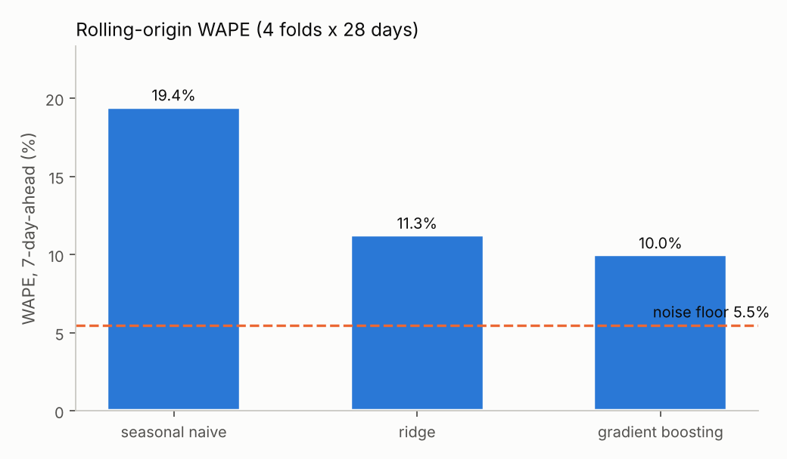
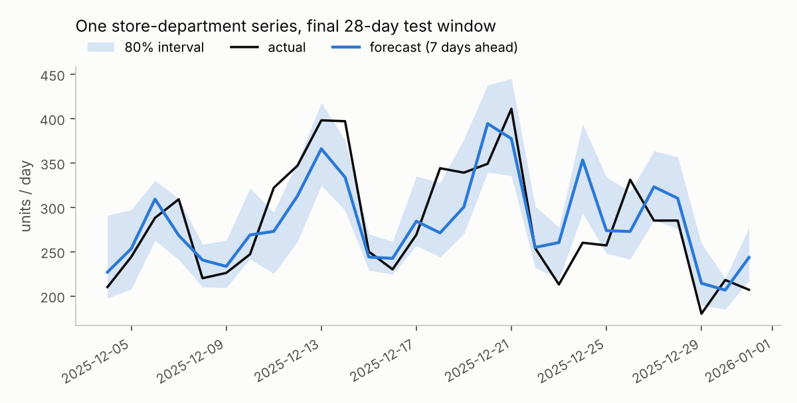

# 03 - 7-day-ahead demand forecasting

Classic predictive analytics done carefully: leak-free features, rolling-origin validation, time-ordered tuning, prediction intervals, an oracle
noise floor for context and a translation to business terms. Data: 24 synthetic store x department series, 1,095 days. Full memo:
[`results/business_memo.md`](results/business_memo.md).

## Results (WAPE, mean of 4 rolling-origin folds x 28 days; lower is better)
| model | WAPE | std over folds | bias |
|---|---|---|---|
| seasonal naive (same weekday last week) | 19.45% | 1.64pp | +0.5% |
| ridge (log target, log-scaled lags) | 11.26% | 1.10pp | -0.1% |
| histogram gradient boosting (tuned) | **9.99%** | 0.50pp | -0.6% |
| *oracle that knows the true Poisson rate* | *5.48%* | | |

Gradient boosting cuts error by 48.6% vs seasonal naive. The oracle row is the irreducible count-noise floor of this synthetic data - real data
has no such number, so on real data the equivalent sanity check is a held-out comparison against the planners' current forecast.




**Prediction interval:** the 10th-90th percentile band covers **73.7%** of actuals against a nominal 80% - it is *under-covering*. Fix to try next:
conformal calibration on a rolling window.

**Top drivers** (permutation importance, last fold): `roll_mean_28`, `lag_7`, `lag_21`, `lag_14`, `lag_28`, then promo and days-to-holiday.

## Method notes
- **Horizon H = 7.** The row for day *t* is built as if the forecast were issued on *t - 7*: lags >= 7, rolling stats shifted by 7. Planned promos and prices are
  legitimately known in advance.
- **Leakage test:** `tests/test_forecasting.py` corrupts every actual from day D onward and asserts no feature for rows before D + 7 changes. Another test asserts
  each fold's training set ends before the forecast origin and that folds don't overlap. The oracle `true_rate` column is asserted never to be a feature.
- **Tuning** uses a time-ordered validation block that ends before the first test fold (8-point grid); folds are then scored with those parameters.
- **A fair baseline:** my first ridge scored 28.9% WAPE (worse than seasonal naive) because raw-scale lags don't suit a log target; log-scaling the lags gave 11.3%.
  I fixed the baseline rather than reporting the straw man.
- **Business translation** uses ASSUMED unit costs, a 20% holding rate and a 95% service level to turn error into safety-stock cost (stylized, ignores lead-time
  aggregation and stock-out cost). Treat it as "why error matters", not a savings forecast.

## Run
```bash
python -m unittest discover -s tests -v    # 10 tests
python run_experiment.py                   # ~35 s -> results/{metrics.json, fold_metrics.csv, tuning_grid.csv, permutation_importance.csv, business_memo.md, *.png}
```

## Limitations
- Synthetic data with a known generating process; promos are known exactly in advance; no new-item/cold-start handling; no hierarchy reconciliation.
- Single synthetic realization (seed 42) - no confidence interval across data seeds.
