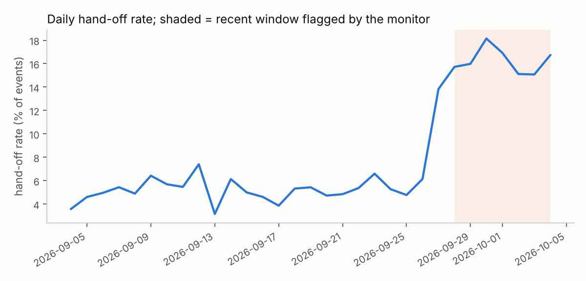

# 04 - Conversation-log data pipeline & monitoring

Turns the assistant's raw JSONL conversation logs (schema contract: `01/src/support_agent/conv_logging.py`) into a trustworthy analytics layer.
Full auto-generated output: [`results/quality_report.md`](results/quality_report.md).

```
raw JSONL -> ingest + validate (declarative schema) -> quarantine bad rows with reason codes
          -> dedupe (at-least-once delivery) -> PII redaction -> enrich (session table, flags)
          -> publish partitioned CSV (date=YYYY-MM-DD/) + sessions.csv + quarantine.jsonl
          -> quality gates -> daily KPIs -> drift detection (PSI + two-proportion test)
```

## Results on the generated dirty log (16,733 lines, 30 days)
| stage | rows |
|---|---|
| quarantined (invalid JSON / schema) | 1,138 |
| duplicates dropped | 292 |
| curated events | 15,303 |
| sessions | 6,464 |

**Detection vs seeded ground truth (the generator records every defect it injects):** 1,084/1,084 schema defects removed from curated data, each quarantined
with a reason code; 54/54 truncated-JSON lines quarantined; 292/292 duplicates dropped; **0 clean events lost or wrongly quarantined**; 556/556 events
containing PII redacted, 0 PII strings left in curated text. *Caveat:* perfect detection is expected - the validators were written for the same defect taxonomy
the generator injects. Real logs have unknown unknowns; that is why the quarantine is kept and reviewed rather than discarded.

**Quality gates:** quarantine rate 6.8% **FAILS** its 5% threshold (this feed is deliberately dirtier than the gate; the gate was set before the run). With
`--strict` the CLI exits 1, which is how an orchestrator would stop a publish or page someone. Duplicate rate, PII-remaining = 0 and freshness pass.

**Monitoring:** the generator makes the last 7 days drift (more hand-offs/returns). The monitor flags it: intent-mix PSI **0.23** (alert > 0.2) and hand-off rate
5.1% -> 16.2% (z = 18.5). A negative control (same data without the drifted week) raises no alert (`tests/test_pipeline.py`).



## Design notes
- Each stage is a small pure function (`stages.py`), so wrapping them as Airflow/Prefect tasks needs no rewrite (no DAG file is shipped).
- The pipeline has its **own** PII redactor (`pii.py`) so logs written by older or misconfigured assistants are still cleaned; it handles `(555) 123-4567`,
  which the assistant's live guardrail misses (found by project 2's held-out eval).
- Booleans are not accepted as numbers; timestamps are checked for parseability, future dates and staleness; arrival order is not assumed chronological.

## Run
```bash
python -m unittest discover -s tests -v          # 17 tests (end-to-end defect/PII/dup accounting, schema codes, PSI, drift with negative control)
python run_pipeline.py --regenerate [--strict]   # ~6 s; raw + curated data go to data/ (gitignored, ~12 MB); reports go to results/
```

## Limitations
- Synthetic logs; CSV partitions only (no Parquet writer implemented or tested); no incremental/idempotent re-runs or schema evolution handling;
  PII regexes are heuristic (names and addresses are not detected).
