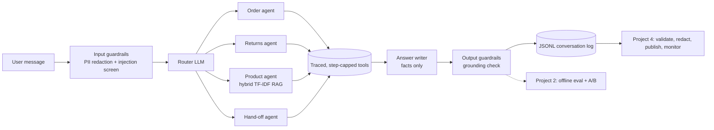

# Generative & Agentic AI Portfolio

Four small, runnable projects covering the full loop of building a production-minded conversational AI system:
**design the agent -> evaluate it rigorously -> forecast with classic ML -> run the data pipeline and monitoring behind it.**

> **Read this first (honest scope).**
> Everything here runs offline on **synthetic data**, and the "LLM" in project 1 is a **deterministic rule-based stand-in**
> (real Anthropic / OpenAI-compatible HTTP backends are included but were *not* exercised against a live model).
> The numbers measure the *engineering* - orchestration, guardrails, evaluation methodology, pipeline correctness - not the
> quality of any language model. Each project's README lists its limitations explicitly.

| # | Project | What it shows | Headline result (all synthetic) |
|---|---|---|---|
| 1 | [`01-agentic-support-assistant`](01-agentic-support-assistant) | Multi-agent design: router, tool-using specialists, RAG product search, input/output guardrails, step caps, logging, FastAPI + Docker | Same 285-case suite: baseline 34% task success -> improved version 98% on dev phrasings |
| 2 | [`02-eval-framework`](02-eval-framework) | Offline benchmark, held-out split, error analysis, paired stats, judge audit, retrieval metrics, A/B planning | **Dev 98% vs held-out 70%**: the generalization gap is the main finding |
| 3 | [`03-demand-forecasting`](03-demand-forecasting) | Leak-free features, rolling-origin validation, tuning, prediction intervals, business translation | WAPE 9.99% vs 19.45% seasonal-naive (oracle noise floor 5.48%) |
| 4 | [`04-conversation-data-pipeline`](04-conversation-data-pipeline) | Schema validation, quarantine, dedupe, PII redaction, quality gates, drift monitor | 1,084/1,084 seeded defects caught, 0 false quarantines; drift flagged (PSI 0.23) |



## Run everything

```bash
pip install -r requirements.txt            # numpy, pandas, scikit-learn, scipy, matplotlib (+ fastapi for the API)
for d in 0*/; do (cd "$d" && python -m unittest discover -s tests); done

cd 02-eval-framework        && python run_eval.py          # ~6 s  -> results/report.md + charts
cd 03-demand-forecasting    && python run_experiment.py    # ~35 s -> results/business_memo.md + charts
cd 04-conversation-data-pipeline && python run_pipeline.py --regenerate   # ~6 s -> results/quality_report.md
cd 01-agentic-support-assistant  && python scripts/chat_cli.py --trace    # talk to the assistant
```

Test counts at time of writing: project 1: 25 pass + 1 skipped (API test needs FastAPI); project 2: 15; project 3: 10; project 4: 17.

## How this maps to the job description

| Requirement | Where |
|---|---|
| Generative / conversational systems, tool use, orchestration | `01` - `assistant.py`, `tools.py`, `llm.py` (pluggable backends) |
| Agentic design: multi-agent workflow, reasoning/tool chains | `01` - router + order / returns / product / hand-off agents, step cap |
| Prompting: system prompts, structured output, retrieval, guardrails | `01` - `prompts.py` (JSON-only routing, facts-only answers), `retrieval.py`, `guardrails.py` |
| End-to-end pipeline incl. monitoring | `01` -> `04` (log schema contract, quality gates, drift alerts) |
| Error analysis & continuous improvement | `02` - failure taxonomy, clustering, v2 -> v2.1 fix, held-out roadmap |
| Eval frameworks, offline benchmarks, A/B testing | `02` - 285-case dev + 285-case held-out suites, McNemar, bootstrap CI, sample-size, peeking, CUPED |
| Predictive analytics / ML / validation / tuning | `03` - rolling-origin CV, time-ordered tuning, quantile intervals, permutation importance |
| Python + data pipelines, data quality & governance | `04` - schema rules, quarantine, PII redaction, gates |
| Translate business context into data solutions; communicate | `03/results/business_memo.md`, per-project READMEs |

## Things worth discussing in an interview

1. **The dev-vs-held-out gap (98% -> 70%).** Same code, new phrasings. I wrote the held-out templates *after* freezing the versions and
   deliberately did not patch what it exposed, so the number stays honest. The failure clusters are the roadmap.
2. **A text-only judge misses behavioural failures.** On the dev set the baseline initiates returns for ineligible orders while sounding
   polite; a reply-text judge passes 49% of that version's task failures (`02/results/report.md`, section 3).
3. **Error analysis found real bugs, not just score gaps:** fuzzy matching turned "trick" into "track" and "weather" into "water";
   the output guardrail flagged an *example* order number inside a "please share your order number" reply; a ridge baseline that
   looked 2x worse than seasonal-naive was actually a feature-scaling mistake (log lags), fixed so the baseline is fair.
4. **Leakage is tested, not assumed:** corrupting all future actuals must not change any feature for earlier rows (`03/tests`).
5. **Calibration honesty:** the nominal-80% forecast interval covers 73.7%; the memo says so and names conformal calibration as the fix.
6. **Simulation vs. measurement:** the A/B section is explicitly a simulation with assumed rates; it demonstrates sample-size planning,
   the Type-I inflation from peeking (5.1% single look vs 12.8% over 5 looks) and CUPED, not a real experiment.

## Known limitations (all projects)
- No real data, no human annotations; labels are generated, and the system and its test sets share an author.
- `LLMJudge`, `AnthropicLLM`, `OpenAICompatLLM`, the FastAPI app, the Dockerfile and the CI workflow were written but **not executed**
  in the environment this repo was built in (no package index, network or Docker). Unit tests cover the logic around them; see each README.
- Parquet output in project 4 is not implemented (CSV partitions only).
